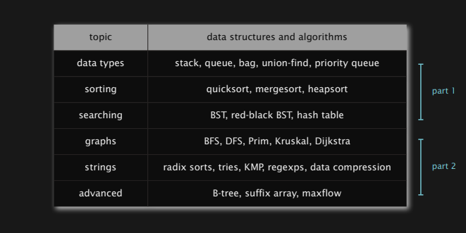

# Welcome to the data structures and algorithms playground!

---

## This repository follows a coursera course by Kevin Wayne and Robert Sedgewick that is offered by Princeton University. If you want to take a look at the course yourself [click here!](https://www.coursera.org/learn/algorithms-part1)


---

## At the moment this repository is in Algorithms, Part I



---

### Why study algorithms and data structures?
- They have an impact in many areas.
- Old roots, new opportunities.
- To solve difficult problems.
- To exercise the mind.
- To become a proficient programmer.
- To create computational models that explain real-world systems.
- For fun and profit. ***:D***

### What does the course cover?
*It is an intermediate-level survey course*
- Programming and problem-solving, in the context of real applications.
- **Algorithm:** method for solving a problem.
- **Data structure:** method to store information.
- The course is split into two parts, classic data type sorting and searching, and then more advanced algorithms developed from the aforementioned.

### Prerequisites
- Programming: loops, arrays functions, objects, recursion.
- Java: used as an expository language.
- Mathematics: high-school algebra.

---
### Resources
#### [Booksite.](https://algs4.cs.princeton.edu/home/)
- Lecture slides.
- Download code.
- Summary of content.

#### Textbook (optional)
- More extensive coverage of topics
- More topics
> **ISBN 0-321-57351-X**

---

#### [algs4.jar](https://algs4.cs.princeton.edu/code/)
- Important library used throughout the course to implement solutions.
- A local Maven repository is necessary to use it with Maven.

*Quick Setup*

- We are assuming you have your [JDK11](https://www.oracle.com/java/technologies/javase/jdk11-archive-downloads.html) variables already setup.
- Install [Maven](https://maven.apache.org/download.cgi) and setup the environment variables.
- Insert a new dependency in the pom.xml. This repository already has a preconfigured one.

```xml
<dependencies>
  <dependency>
    <groupId>edu.princeton.cs</groupId>
    <artifactId>algs4</artifactId>
    <version>dev</version>
  </dependency>
</dependencies>
```

- With the dependency now present, run the following command to create a local Maven repository for algs4.
  **Make sure to replace "Directory" with where you saved the algs4.jar and are in the project directory.**
> mvn install:install-file -Dfile=*Directory*/algs4.jar -DgroupId=edu.princeton.cs -DartifactId=algs4 -Dversion=dev -Dpackaging=jar -Dsources=*Directory*/algs4.jar -Durl=https://algs4.cs.princeton.edu/code/javadoc/ -Dclassifier=javadoc

- That should be it! Now try to import one of the classes from the algs4 library.
```java
import edu.princeton.cs.algs4.StdIn;

public class RandomWord {
  public static void main(String[] args) {
    while (StdIn.isEmpty()) {
      // ...
    }
  }
}
```